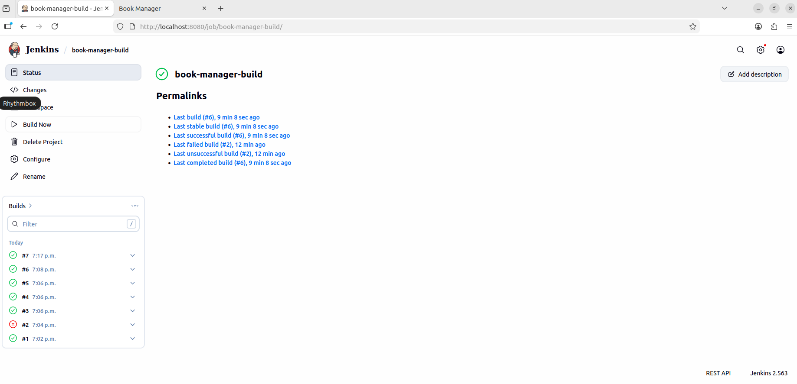
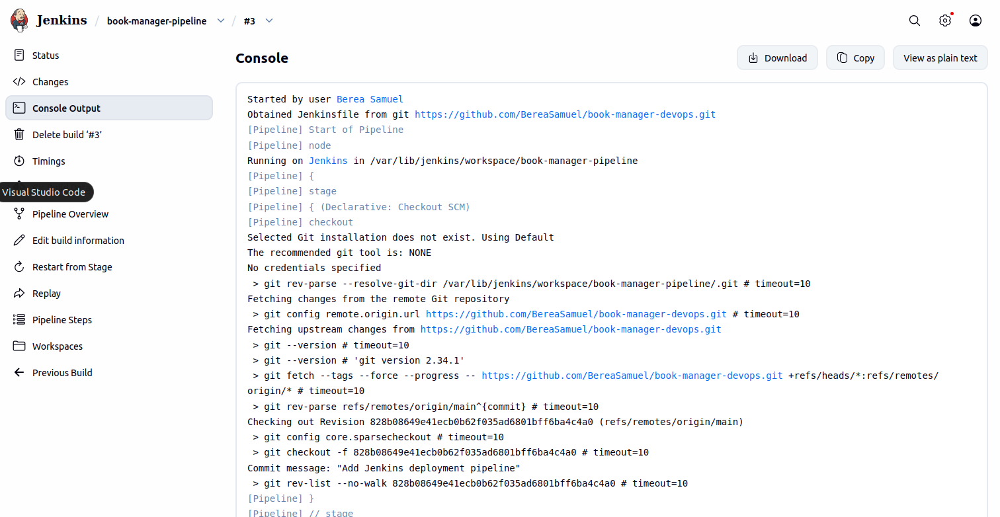
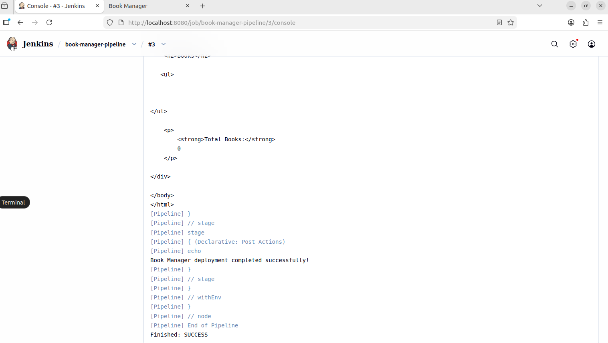

# 📚 Book Manager

## Project Description

Book Manager is a web application developed with **Python** and **Flask** that allows users to manage a collection of books.

The application provides a simple interface for adding, viewing, editing, and deleting books. All data is stored in a **SQLite** database.

The project also demonstrates **Docker containerization** and **Continuous Integration (CI)** using **Jenkins**.

---

# Current Project Status

**Current Phase:** Continuous Integration (CI)

### Completed

- Flask web application
- SQLite database integration
- Automatic database initialization
- CRUD operations (Create, Read, Update, Delete)
- Dynamic book counter
- Docker containerization
- Jenkins Continuous Integration
- Jenkins Pipeline as Code
- Automated application tests
- Persistent SQLite storage using Docker Volumes

---

# Technologies Used

## Backend

- Python 3
- Flask

## Frontend

- HTML5
- CSS3

## Database

- SQLite

## DevOps

- Git
- GitHub
- Docker
- Jenkins

---

# Features

- Add new books
- View all books
- Edit existing books
- Delete books
- SQLite database integration
- Automatic database initialization
- Docker containerization
- Jenkins Continuous Integration
- Persistent SQLite storage using Docker Volumes
- Automated application testing
- Jenkins Pipeline with automated testing and deployment

## Add Book

Users can add a new book by providing:

- Book Title
- Author Name

## View Books

All books stored in the database are displayed on the main page.

## Edit Book

Users can update existing book information.

## Delete Book

Users can remove books from the collection.

## Book Counter

The application automatically displays the total number of books currently stored in the database.

---

# CRUD Operations

| Operation | Description | Status |
|----------|-------------|--------|
| Create | Add a new book | ✅ Completed |
| Read | Display all books | ✅ Completed |
| Update | Edit existing books | ✅ Completed |
| Delete | Remove books | ✅ Completed |

---

# Project Structure

book-manager/
│
├── app.py
├── init_db.py
├── books.db
├── test_app.py
├── Dockerfile
├── Jenkinsfile
├── .dockerignore
├── .gitignore
├── requirements.txt
├── README.md
│
├── static/
│   └── style.css
│
├── templates/
│   ├── index.html
│   └── edit.html
│
└── Screenshots/
    ├── webapp.png
    ├── docker.png
    ├── jenkins-build.png
    └── jenkins-pipeline.png
    └── jenkins-pipeline2.png
```

---

# Database

**Database Engine**

SQLite

**Database File**

```
books.db
```

**Table**

```
books
```

### Columns

- id
- title
- author

---

# Installation

Clone the repository:

```bash
git clone https://github.com/BereaSamuel/book-manager-devops.git
cd book-manager-devops
```

Install dependencies:

```bash
pip3 install -r requirements.txt
```

Start the application:

```bash
python3 app.py
```

Open the application:

```
http://localhost:5000
```

> The SQLite database and the required table are automatically created on the first application startup.

---

# Application Workflow

1. Start the application.
2. Add a new book.
3. View all books.
4. Edit existing books.
5. Delete books.
6. Changes are automatically saved in the SQLite database.

---

# Docker

The application is containerized using Docker.

## Build the Docker image

```bash
docker build -t book-manager:1.0 .
```

## Run the Docker container

```bash
docker run -d --name book-manager-container -p 5000:5000 book-manager:1.0
```

## Check running containers

```bash
docker ps
```

Open the application:

```
http://localhost:5000
```

---

# Jenkins Continuous Integration

A Jenkins Freestyle Job is configured to automate the deployment process.

The Jenkins job performs the following steps:

1. Clone the project from GitHub.
2. Build the Docker image.
3. Stop the previous Docker container (if it exists).
4. Start a new Docker container.
5. Deploy the application on port **5001**.

Open the application deployed by Jenkins:

```
http://localhost:5001
```
## Automated Tests

The project includes automated tests created with Python's built-in `unittest` framework.

The tests verify that:

- The home page loads successfully.
- A new book can be added successfully.
- The application returns the expected content.

Run the tests locally:

```bash
python3 -m unittest test_app.py


---
## Jenkins Pipeline

The Jenkins Pipeline automates the Continuous Integration and deployment process.

The pipeline performs the following steps:

1. Checks out the source code from GitHub.
2. Installs the required Python dependencies.
3. Runs automated tests using Python `unittest`.
4. Builds the Docker image.
5. Stops and removes the previous Docker container.
6. Starts a new Docker container.
7. Verifies that the application is running successfully.

If an automated test fails, the pipeline stops and the application is not deployed.

The application deployed by the Jenkins Pipeline is available at:

```text
http://localhost:5002

## Data Persistence

The SQLite database is stored in a Docker named volume:

```text
book-manager-data

# Screenshots

## Web Application


## Docker Container Running


## Jenkins Build



## Jenkins Pipeline


---

# Future Improvements

- Jenkins Pipeline using Jenkinsfile
- Docker Hub integration
- Automated testing
- GitHub Webhooks
- Deployment to Kubernetes

---

# Author

**Samuel Berea**

GitHub:

https://github.com/BereaSamuel