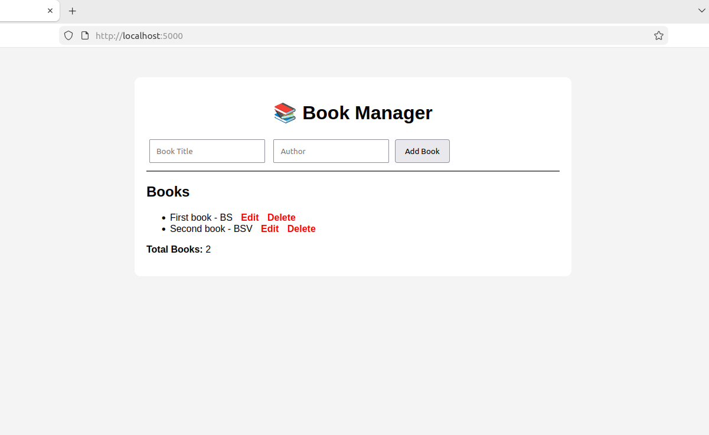
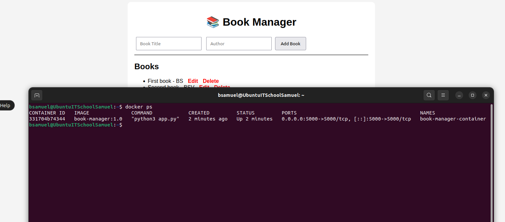

# Book Manager

## Project Description

Book Manager is a web application developed using Python and Flask that allows users to manage a collection of books.

The application provides a simple interface for adding, viewing, updating and deleting books. All data is stored in a SQLite database.

---

## Current Project Status

Current Phase: Application Development

Completed:

* Flask application setup
* SQLite database integration
* Add Book functionality
* View Books functionality
* Edit Book functionality
* Delete Book functionality
* Dynamic Book Counter

---

## Technologies Used

### Backend

* Python 3
* Flask

### Frontend

* HTML5
* CSS3

### Database

* SQLite

---

## Features

### Add Book

Users can add a new book by providing:

* Book Title
* Author Name

### View Books

All books stored in the database are displayed on the main page.

### Edit Book

Users can update existing book information.

### Delete Book

Users can remove books from the collection.

### Book Counter

The application automatically displays the total number of books currently stored in the database.

---

## CRUD Operations

| Operation | Description         | Status    |
| --------- | ------------------- | --------- |
| Create    | Add a new book      | Completed |
| Read      | Display all books   | Completed |
| Update    | Edit existing books | Completed |
| Delete    | Remove books        | Completed |

---

## Project Structure

book-manager/

├── app.py

├── init_db.py

├── books.db

├── requirements.txt

├── README.md

├── static/

│ └── style.css

└── templates/

├── index.html

└── edit.html

---

## Database

Database Engine:

SQLite

Database File:

books.db

Table:

books

Columns:

* id
* title
* author

---

## Installation

Clone or download the project.

Install Flask:

pip3 install flask

Create the database:

python3 init_db.py

Start the application:

python3 app.py

Open the application:

http://localhost:5000

---

## Application Workflow

1. Open the application.
2. Add a new book.
3. View all books.
4. Edit book information.
5. Delete books.
6. Changes are automatically saved in the SQLite database.

---

## Docker

The application is containerized with Docker and exposed on port 5000.

### Run with Docker

Build the image:

```bash
docker build -t book-manager:1.0 .

### Run the container:
docker run -d --name book-manager-container -p 5000:5000 book-manager:1.0

### Check the container:
docker ps
---

## Screenshots

### Web application




### Docker container running



---

## Author
Samuel Berea
